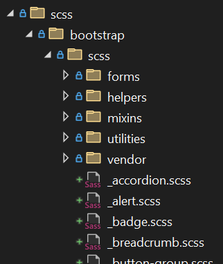
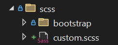

# Styling Blazor Apps

## Creating the Solution

1. Open Visual Studio
2. Click on Create a new project
3. Select Blazor Web App
4. Click Next
5. Enter the project name: `BlazorHolStyling`
6. Click Next
7. Use the following options:
   - Framework: .NET 10.0
   - Authentication Type: None
   - Configure for HTTPS: Checked
   - Interactive render mode: Auto (Server and WebAssembly)
   - Interactivity location: Per page/component
   - Include sample pages: Checked
8. Click Create

## Setting Global CSS

1. Open the `wwwroot` folder in the server project
2. Open the `app.css` file
3. Edit the `.btn-primary` class to have the following styles:

```css
.btn-primary {
    color: #929292;
    background-color: #26b050;
    border-color: #1861ac;
}

.btn-primary:hover {
    color: #808080;
    background-color: #00ff21;
    border-color: #285e8e;
}

.btn-primary:focus {
    color: #929292;
    background-color: #26b050;
    border-color: #000000;
}
```

4. Press F5 to run the app
5. Navigate to the Counter page
6. The button should now have the styles defined in the `app.css` file
7. Close the browser

## Setting Per-Component CSS

1. Open the `Counter.razor` file in the `Pages` folder
2. Right-click on the `Pages` folder in Solution Explorer and select Add -> New Item
3. Add a file named `Counter.razor.css`
4. Add the following CSS to the `Counter.razor.css` file:

```css
h1 {
    color: brown;
    font-family: Tahoma, Geneva, Verdana, sans-serif;
}

button {
    background-color: brown;
    color: white;
    font-family: Tahoma, Geneva, Verdana, sans-serif;
}
```

5. Press F5 to run the app
6. Navigate to the Counter page
7. The `h1` and `button` elements should now have the styles defined in the `Counter.razor.css` file
8. Close the browser
9. Open the `App.razor` file in the server project `Components` folder
10. Notice the consolidated css link:

```html
    <link rel="stylesheet" href="@Assets["BlazorHolStyling.styles.css"]" />
```

This is the consolidated CSS file that contains all the per-component CSS files in the project.

## Customizing Bootstrap

To customize Bootstrap you need to recompile Bootstrap to integrate your changes. You can use the `DartSassBuilder` NuGet package to compile the SCSS files in the project.

1. Add a reference to the `DartSassBuilder` NuGet package in the server project.
2. Create a new `scss` folder in the server project.
3. Download the Bootstrap source files from the [official website](https://getbootstrap.com/docs/5.3/getting-started/download/) and extract the `scss` folder from the zip archive to the `scss` folder in your project.
   - The .NET 10 Blazor template uses Bootstrap 5.3.3 (see `wwwroot/lib/bootstrap`), so use a 5.3.x version of the source files (e.g. [v5.3.3](https://github.com/twbs/bootstrap/archive/v5.3.3.zip)). You don't need the `scss/tests` folder.

4. Add a new file named `custom.scss` to the `scss` folder.

5. Add the following code to the `custom.scss` file:

```scss
/* Colors */
$primary: red;
$secondary: #70af6d;

$link-color: $primary;

@import "bootstrap/scss/bootstrap.scss";

.btn-primary, .btn-primary:active, .btn-primary:focus, .btn-primary:checked {
  background-color: $primary;
  border-color: $gray-100;
  color: white;
}
```

These override defaults in Bootstrap. For example, the `$primary` variable is set to red, and the `.btn-primary` class is customized to have a red background color.

6. Open the `BlazorHolStyling.csproj` file in the server project
7. Add the following code to the file:

```xml
  <Target Name="CopyCssBundles" AfterTargets="DartSass_Build">
    <ItemGroup>
      <MyCssBundles Include="scss\custom.css" />
    </ItemGroup>
    <Copy SourceFiles="@(MyCssBundles)" DestinationFiles="wwwroot\%(Filename)%(Extension)" SkipUnchangedFiles="true" OverwriteReadOnlyFiles="true" />
    <ItemGroup>
      <Content Include="wwwroot\custom.css" Exclude="@(Content)" />
    </ItemGroup>
  </Target>
```

This copies the compiled CSS file to the `wwwroot` folder right after `DartSassBuilder` compiles the SCSS files, which is early in the build process. This matters because `app.MapStaticAssets()` serves files based on a manifest (with fingerprinted file names) that is generated during the build, so `custom.css` must be in `wwwroot` before that happens.

8. Open the `App.razor` file in the `Components` folder
9. Comment out the `app.css` link and add a link to the `custom.css` file:

```html
@*  <link rel="stylesheet" href="@Assets["app.css"]" /> *@
    <link rel="stylesheet" href="@Assets["custom.css"]" />
```

10. Build the solution
11. Notice the `custom.css` file in the `wwwroot` folder
12. Open the `custom.css` file to see the compiled CSS
13. Press F5 to run the app
14. Navigate to the Counter page
15. The button should now have the styles defined in the `custom.css` file

⚠️ **Note:** Browser caching can cause styles to not appear immediately. You may need to clear your browser cache or use a private browsing window to see the changes.
