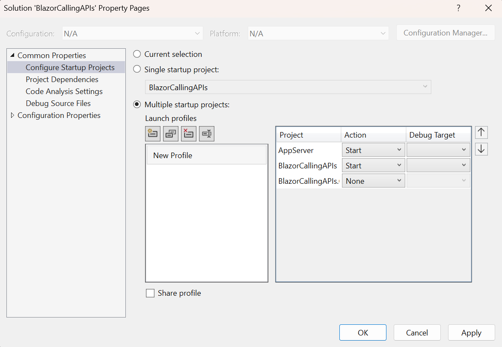

# Calling Web APIs

## Creating the Solution

1. Open Visual Studio
2. Click on Create a new project
3. Select Blazor Web App
4. Click Next
5. Enter the project name: `BlazorCallingAPIs`
6. Click Next
7. Use the following options:
   - Framework: .NET 10.0
   - Authentication Type: None
   - Configure for HTTPS: Checked
   - Interactive render mode: Auto (Server and WebAssembly)
   - Interactivity location: Per page/component
   - Include sample pages: Checked
8. Click Create

## Adding an AppServer project

1. Right-click on the solution
2. Click on Add > New Project
3. Select ASP.NET Core Web API
4. Click Next
5. Enter the project name: `AppServer`
6. Click Next
7. Use the following options:
   - Target Framework: .NET 10.0
   - Authentication Type: None
   - Configure for HTTPS: Checked
   - Enable OpenAPI support: Unchecked
   - Use controllers: Checked
8. Click Create
9. Run the AppServer project from Visual Studio
10. Make note of the port number: `https://localhost:????` (you can also find it in the `https` profile in the `Properties/launchSettings.json` file of the AppServer project)

## Examine the WeatherForecast class

1. Open the `WeatherForecast.cs` file in the `AppServer` project
2. Notice the class has the same properties as the `WeatherForecast` class in the Blazor project
3. This class will be used to return data from the Web API

## Examine the WeatherForecastController

1. Open the `WeatherForecastController.cs` file in the `AppServer` project
2. Notice the `Get` method returns an array of `WeatherForecast` objects
3. This method will be used to return data from the Web API

## Configure Startup Projects

1. Right-click on the solution
2. Click on Configure Startup Projects
3. Select Multiple startup projects
4. Set the Action for the `BlazorCallingAPIs` project to Start
5. Set the Action for the `AppServer` project to Start
6. Click OK



## Using the API in the Blazor project

1. Open the `Weather.razor` file in the `BlazorCallingAPIs` project
2. Add a `using` statement for the `System.Net.Http.Headers` namespace below the `@page` directive

```html
@using System.Net.Http.Headers
```

3. Change the `OnInitializedAsync` method in the `Weather.razor` page to use the Web API

```csharp
    protected override async Task OnInitializedAsync()
    {
        var httpClient = new HttpClient();
        httpClient.DefaultRequestHeaders.Authorization = new AuthenticationHeaderValue("Bearer", "MyBearerTokenValue");
        forecasts = await httpClient.GetFromJsonAsync<WeatherForecast[]>("https://localhost:7285/weatherforecast");
    }
```

> ⚠️ Change the port from `7285` to the port of _your_ AppServer project

4. Run the application
5. Navigate to the `Weather` page
6. You will see the weather forecast data loaded from the Web API

## Using the API from a WebAssembly Page

1. Add a new `ClientWeather.razor` file to the `Pages` folder in the _client_ project
2. Copy the contents of the `Weather.razor` file to the new file
3. Change the `ClientWeather.razor` page to use interactive WebAssembly rendering

```html
@rendermode InteractiveWebAssembly
```

4. Change the title of the page to `Client Weather`

```html
<PageTitle>Client Weather</PageTitle>

<h3>Client Weather</h3>
```

5. Add the new page to the navigation menu by editing the `NavMenu.razor` file in the server project

```html
        <div class="nav-item px-3">
            <NavLink class="nav-link" href="clientweather">
                <span class="bi bi-list-nested-nav-menu" aria-hidden="true"></span> Client Weather
            </NavLink>
        </div>
```

6. Run the application
7. Navigate to the `Client Weather` page
8. Notice that the data is not loaded!

The data can't be loaded from a client app because of cross-origin resource sharing (CORS) restrictions. The Web API must be configured to allow requests from the client app.

## Configuring CORS

1. Open the `Program.cs` file in the `AppServer` project
2. Add the following code to enable CORS

```csharp
builder.Services.AddCors(options =>
{
    options.AddPolicy("AllowAllOrigins",
        builder =>
        {
            builder.AllowAnyOrigin()
                   .AllowAnyMethod()
                   .AllowAnyHeader();
        });
});
```

3. Add the following code to use the CORS policy, placing it _before_ the call to `app.UseAuthorization()`

```csharp
app.UseCors("AllowAllOrigins");
```

4. Run the application
5. Navigate to the `Client Weather` page
6. You will see the weather forecast data loaded from the Web API

If you watch closely, you'll see that the data is loaded twice! This is because the page is rendered twice - once on the server (server static rendering) and once on the client (WebAssembly interactive rendering).

## Fixing the Double Load of Data

1. Open the `ClientWeather.razor` file in the client project
2. Add the following code to the file to prevent the data from being loaded twice

```html
@page "/clientweather"
@using System.Text.Json
@using System.Net.Http.Headers
@rendermode InteractiveWebAssembly
@implements IDisposable

@inject PersistentComponentState ApplicationState
```

3. Add a field in the `@code` block for the `PersistingComponentStateSubscription` subscription

```csharp
    private PersistingComponentStateSubscription _subscription;
```

4. Add the following code to the `OnInitializedAsync` method

```csharp
    protected override async Task OnInitializedAsync()
    {
        _subscription = ApplicationState.RegisterOnPersisting(Persist);

        var foundInState = ApplicationState
            .TryTakeFromJson<WeatherForecast[]>("forecasts", out forecasts);

        if (!foundInState)
        {
            var httpClient = new HttpClient();
            httpClient.DefaultRequestHeaders.Authorization = new AuthenticationHeaderValue("Bearer", "MyBearerTokenValue");
            forecasts = await httpClient.GetFromJsonAsync<WeatherForecast[]>("https://localhost:7285/weatherforecast");
        }
    }
```

> ⚠️ Change the port from `7285` to the port of _your_ AppServer project

5. Add the following `Persist` method to the `@code` block

```csharp
    private Task Persist()
    {
        ApplicationState.PersistAsJson("forecasts", forecasts);
        return Task.CompletedTask;
    }
```

6. Add the following `Dispose` method to the `@code` block

```csharp
    public void Dispose()
    {
        _subscription.Dispose();
    }
```

7. Run the application
8. Navigate to the `Client Weather` page
9. You will see the weather forecast data loaded from the Web API
10. The data will only be loaded once

Another alternative is to detect the render mode and only load the data one time, usually once the page has rendered in interactive mode.

> ℹ️ The completed `ClientWeather.razor` in this lab's solution uses this alternative: it uses the `Marimer.Blazor.RenderMode` package to detect the render mode and only calls the API when the page is interactive. The `PersistentComponentState` code from above is left in the file as comments for comparison.

## Securing the API

Securing the API is a two-step process:

- **Authentication** determines _who_ the caller is. The caller's token is validated and turned into a `ClaimsPrincipal`. If there is no valid token, the API returns `401 Unauthorized`.
- **Authorization** determines _what_ the caller is allowed to do, based on the claims in that `ClaimsPrincipal`. If the caller is authenticated but lacks the required permission, the API returns `403 Forbidden`.

### Authenticating the token

1. Add a `BearerAuthnHandler` class to the `AppServer` project

```csharp
using System.Security.Claims;
using System.Text.Encodings.Web;
using Microsoft.AspNetCore.Authentication;
using Microsoft.Extensions.Options;

namespace AppServer;

public class BearerAuthnHandler(
    IOptionsMonitor<AuthenticationSchemeOptions> options,
    ILoggerFactory logger,
    UrlEncoder encoder)
    : AuthenticationHandler<AuthenticationSchemeOptions>(options, logger, encoder)
{
    public const string SchemeName = "Bearer";

    // Hardcoded tokens and the scopes each one grants
    private static readonly Dictionary<string, string[]> Tokens = new()
    {
        ["MyBearerTokenValue"] = ["weather.read"],
        ["MyLimitedTokenValue"] = []
    };

    protected override Task<AuthenticateResult> HandleAuthenticateAsync()
    {
        string? header = Request.Headers.Authorization;
        if (string.IsNullOrWhiteSpace(header) || !header.StartsWith("Bearer ", StringComparison.OrdinalIgnoreCase))
        {
            return Task.FromResult(AuthenticateResult.NoResult());
        }

        var token = header["Bearer ".Length..].Trim();
        if (!Tokens.TryGetValue(token, out var scopes))
        {
            return Task.FromResult(AuthenticateResult.Fail("Invalid bearer token"));
        }

        var claims = new List<Claim> { new(ClaimTypes.Name, "ApiClient") };
        claims.AddRange(scopes.Select(scope => new Claim("scope", scope)));
        var identity = new ClaimsIdentity(claims, SchemeName);
        var ticket = new AuthenticationTicket(new ClaimsPrincipal(identity), SchemeName);
        return Task.FromResult(AuthenticateResult.Success(ticket));
    }

    protected override Task HandleChallengeAsync(AuthenticationProperties properties)
    {
        Response.StatusCode = StatusCodes.Status401Unauthorized;
        Response.Headers.WWWAuthenticate = SchemeName;
        return Task.CompletedTask;
    }
}
```

This is an ASP.NET Core _authentication_ handler. It reads the `Authorization` header and, if the token is valid, creates a `ClaimsPrincipal` for the caller with a `scope` claim for each permission the token grants. If the token is missing or invalid, the caller is not authenticated, and `HandleChallengeAsync` returns a `401 Unauthorized` response.

This is just an example, and uses hardcoded tokens. In a real-world scenario, you would use a more secure method to validate the token, such as the `Microsoft.AspNetCore.Authentication.JwtBearer` package, where the scopes come from claims inside a signed JWT.

### Authorizing based on the token's claims

2. Add a `ScopeAuthorizationHandler` class to the `AppServer` project

```csharp
using Microsoft.AspNetCore.Authorization;

namespace AppServer;

public class ScopeRequirement(string scope) : IAuthorizationRequirement
{
    public string Scope { get; } = scope;
}

public class ScopeAuthorizationHandler : AuthorizationHandler<ScopeRequirement>
{
    protected override Task HandleRequirementAsync(AuthorizationHandlerContext context, ScopeRequirement requirement)
    {
        if (context.User.HasClaim("scope", requirement.Scope))
        {
            context.Succeed(requirement);
        }
        return Task.CompletedTask;
    }
}
```

The `ScopeRequirement` describes a permission the caller must have, and the `ScopeAuthorizationHandler` checks the claims created by the authentication handler to see if the caller has it. Notice that the authorization handler doesn't look at the token at all; it only uses the authenticated `ClaimsPrincipal`.

### Registering authentication and authorization

3. Register the handlers and an authorization policy in the `Program.cs` file in the `AppServer` project (add `using AppServer;`, `using Microsoft.AspNetCore.Authentication;`, and `using Microsoft.AspNetCore.Authorization;` at the top of the file)

```csharp
builder.Services.AddAuthentication(BearerAuthnHandler.SchemeName)
    .AddScheme<AuthenticationSchemeOptions, BearerAuthnHandler>(BearerAuthnHandler.SchemeName, null);
builder.Services.AddSingleton<IAuthorizationHandler, ScopeAuthorizationHandler>();
builder.Services.AddAuthorization(options =>
{
    options.AddPolicy("BearerAuthn", policy =>
    {
        policy.RequireAuthenticatedUser();
        policy.Requirements.Add(new ScopeRequirement("weather.read"));
    });
});
```

The `BearerAuthn` policy requires an authenticated caller that also has the `weather.read` scope.

4. Add authentication to the request pipeline in the `Program.cs` file, between the `app.UseCors` and `app.UseAuthorization` calls

```csharp
app.UseCors("AllowAllOrigins");

app.UseAuthentication();
app.UseAuthorization();
```

5. Use the policy for all controllers in the `Program.cs` file in the `AppServer` project

```csharp
app.MapControllers().RequireAuthorization("BearerAuthn");
```

### Supplying the token

6. Supply the token in the `ClientWeather.razor` file in the client project

```csharp
    var httpClient = new HttpClient();
    httpClient.DefaultRequestHeaders.Authorization = new AuthenticationHeaderValue("Bearer", "MyBearerTokenValue");
    forecasts = await httpClient.GetFromJsonAsync<WeatherForecast[]>("https://localhost:7285/weatherforecast");
```

> ⚠️ Change the port from `7285` to the port of _your_ AppServer project

7. Supply the token in the `Weather.razor` file in the server project

```csharp
    var httpClient = new HttpClient();
    httpClient.DefaultRequestHeaders.Authorization = new AuthenticationHeaderValue("Bearer", "MyBearerTokenValue");
    forecasts = await httpClient.GetFromJsonAsync<WeatherForecast[]>("https://localhost:7285/weatherforecast");
```

> ⚠️ Change the port from `7285` to the port of _your_ AppServer project

### Testing the secured API

8. Run the application
9. In a browser, navigate directly to `https://localhost:????/weatherforecast` (the AppServer port); notice that the weather forecast data is not shown because the request has no bearer token, and the AppServer returns a `401 Unauthorized` response
10. Open the `AppServer.http` file in the `AppServer` project and replace its contents with the following

```http
@AppServer_HostAddress = http://localhost:5204

# No token: 401 Unauthorized
GET {{AppServer_HostAddress}}/weatherforecast/
Accept: application/json

###

# Valid token without the weather.read scope: 403 Forbidden
GET {{AppServer_HostAddress}}/weatherforecast/
Accept: application/json
Authorization: Bearer MyLimitedTokenValue

###

# Valid token with the weather.read scope: 200 OK
GET {{AppServer_HostAddress}}/weatherforecast/
Accept: application/json
Authorization: Bearer MyBearerTokenValue

###
```

> ⚠️ Change the port from `5204` to the `http` port of _your_ AppServer project

11. Click `Send request` above each request and notice the different responses
    - With no token, authentication fails and the response is `401 Unauthorized`
    - With `MyLimitedTokenValue`, the caller is authenticated but doesn't have the `weather.read` scope, so authorization fails and the response is `403 Forbidden`
    - With `MyBearerTokenValue`, the caller is authenticated and authorized, so the weather forecast data is returned
12. Navigate to the `Weather` page
13. You will see the weather forecast data loaded from the Web API
14. Navigate to the `Client Weather` page
15. You will see the weather forecast data loaded from the Web API

## References

https://learn.microsoft.com/aspnet/core/security/authentication/?view=aspnetcore-10.0

https://learn.microsoft.com/aspnet/core/security/authorization/policies?view=aspnetcore-10.0

https://khalidabuhakmeh.com/customize-the-authorization-pipeline-in-aspnet-core
