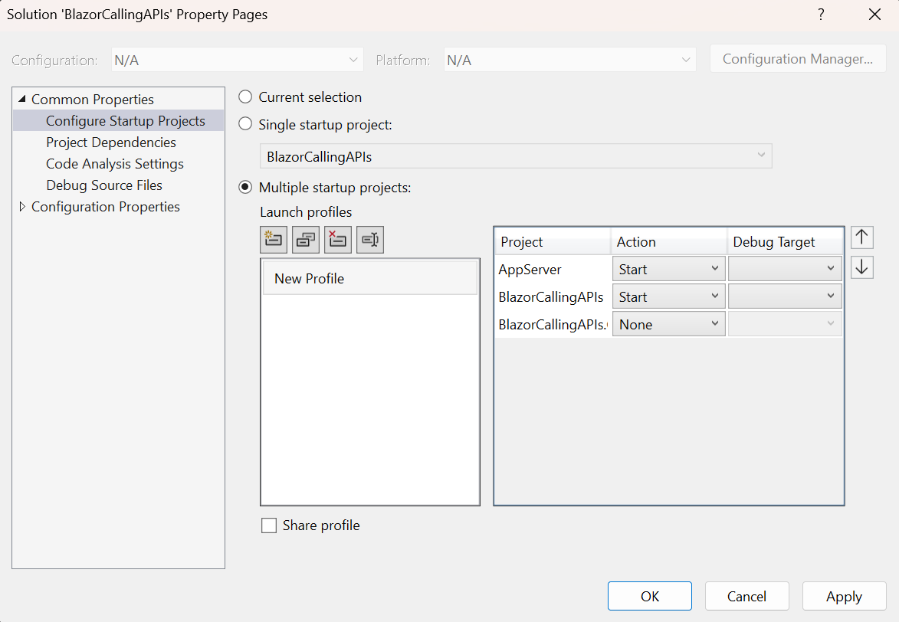

# Calling Web APIs

## Creating the Solution

1. Open Visual Studio
2. Click on Create a new project
3. Select Blazor Web App
4. Click Next
5. Enter the project name: `BlazorHolCallingApis`
6. Click Next
7. Use the following options:
   - Framework: .NET 8.0
   - Authentication Type: None
   - Configure for HTTPS: Checked
   - Interactive render mode: Auto (Server and WebAssembly)
   - Interactivity location: Per page/component
   - Include sample pages: Checked
8. Click Create
9. Run the AppServer project from Visual Studio
10. Make note of the port number: `https://localhost:????`

## Adding an AppServer project

1. Right-click on the solution
2. Click on Add > New Project
3. Select ASP.NET Core Web API
4. Click Next
5. Enter the project name: `AppServer`
6. Click Next
7. Use the following options:
   - Target Framework: .NET 8.0
   - Authentication Type: None
   - Configure for HTTPS: Checked
   - Use controllers: Checked
8. Click Create

## Examine the WeatherForecast class

1. Open the `WeatherForecast.cs` file in the `AppServer` project
2. Notice the class has the same properties as the `WeatherForecast` class in the Blazor project
3. This class will be used to return data from the Web API

## Examine the WeatherForecastController

1. Open the `WeatherForecastController.cs` file in the `AppServer` project
2. Notice the `Get` method returns an array of `WeatherForecast` objects
3. This method will be used to return data from the Web API

## Configure Startup Projects

1. Right-click on the solution
2. Click on Startup Projects
3. Select Multiple startup projects
4. Set the Action for the `BlazorHolCallingApis` project to Start
5. Set the Action for the `AppServer` project to Start
6. Click OK



## Using the API in the Blazor project

1. Open the `Weather.razor` file in the `BlazorHolCallingApis` project
2. Change the `Weather.razor` page to use the Web API

```csharp
    protected override async Task OnInitializedAsync()
    {
        var httpClient = new HttpClient();
        httpClient.DefaultRequestHeaders.Authorization = new AuthenticationHeaderValue("Bearer", "MyBearerTokenValue");
        forecasts = await httpClient.GetFromJsonAsync<WeatherForecast[]>("https://localhost:7285/weatherforecast");
    }
```

> ⚠️ Change the port from `7285` to the port of _your_ AppServer project

3. Run the application
4. Navigate to the `Weather` page
5. You will see the weather forecast data loaded from the Web API

## Using the API from a WebAssembly Page

1. Add a new `ClientWeather.razor` file to the `Pages` folder in the _client_ project
2. Copy the contents of the `Weather.razor` file to the new file
3. Change the `ClientWeather.razor` page to use interactive WebAssembly rendering

```html
@rendermode InteractiveWebAssembly
```

4. Change the title of the page to `Client Weather`

```html
<PageTitle>Client Weather</PageTitle>

<h3>Client Weather</h3>
```

5. Add the new page to the navigation menu by editing the `NavMenu.razor` file in the server project

```html
        <div class="nav-item px-3">
            <NavLink class="nav-link" href="clientweather">
                <span class="bi bi-list-nested-nav-menu" aria-hidden="true"></span> Client Weather
            </NavLink>
        </div>
```

6. Run the application
7. Navigate to the `Client Weather` page
8. Notice that the data is not loaded!

The data can't be loaded from a client app because of cross-origin resource sharing (CORS) restrictions. The Web API must be configured to allow requests from the client app.

## Configuring CORS

1. Open the `Program.cs` file in the `AppServer` project
2. Add the following code to enable CORS

```csharp
builder.Services.AddCors(options =>
{
    options.AddPolicy("AllowAllOrigins",
        builder =>
        {
            builder.AllowAnyOrigin()
                   .AllowAnyMethod()
                   .AllowAnyHeader();
        });
});
```

3. Add the following code to use the CORS policy

```csharp
app.UseCors("AllowAllOrigins");
```

4. Run the application
5. Navigate to the `Client Weather` page
6. You will see the weather forecast data loaded from the Web API

If you watch closely, you'll see that the data is loaded twice! This is because the page is rendered twice - once on the server (server static rendering) and once on the client (WebAssembly interactive rendering).

## Fixing the Double Load of Data

1. Open the `ClientWeather.razor` file in the client project
2. Add the following code to the file to prevent the data from being loaded twice

```html
@page "/clientweather"
@using System.Text.Json
@using System.Net.Http.Headers
@rendermode InteractiveWebAssembly
@implements IDisposable

@inject PersistentComponentState ApplicationState
```

3. Add a field in the `@code` block for the `PersistingComponentStateSubscription` subscription

```csharp
    private PersistingComponentStateSubscription _subscription;
```

4. Add the following code to the `OnInitializedAsync` method

```csharp
    protected override async Task OnInitializedAsync()
    {
        _subscription = ApplicationState.RegisterOnPersisting(Persist);

        var foundInState = ApplicationState
            .TryTakeFromJson<WeatherForecast[]>("forecasts", out forecasts);

        if (!foundInState)
        {
            var httpClient = new HttpClient();
            httpClient.DefaultRequestHeaders.Authorization = new AuthenticationHeaderValue("Bearer", "MyBearerTokenValue");
            forecasts = await httpClient.GetFromJsonAsync<WeatherForecast[]>("https://localhost:7285/weatherforecast");
        }
    }
```

> ⚠️ Change the port from `7285` to the port of _your_ AppServer project

5. Add the following `Persist` method to the `@code` block

```csharp
    private Task Persist()
    {
        ApplicationState.PersistAsJson("forecasts", forecasts);
        return Task.CompletedTask;
    }
```

6. Add the following `Dispose` method to the `@code` block

```csharp
    public void Dispose()
    {
        _subscription.Dispose();
    }
```

7. Run the application
8. Navigate to the `Client Weather` page
9. You will see the weather forecast data loaded from the Web API
10. The data will only be loaded once

Another alternative is to detect the render mode and only load the data one time, usually once the page has rendered in interactive mode.

## Securing the API

1. Add a `BearerAuthnHandler` class to the `AppServer` project

```csharp
using Microsoft.AspNetCore.Authorization;

namespace AppServer;

public class BearerAuthnHandler(IHttpContextAccessor HttpContextAccessor) : AuthorizationHandler<BearerAuthnRequirement>
{
    protected override Task HandleRequirementAsync(AuthorizationHandlerContext context, BearerAuthnRequirement requirement)
    {
        if (HttpContextAccessor is null)
        {
            throw new ArgumentNullException(nameof(HttpContextAccessor));
        }
        var token = HttpContextAccessor.HttpContext?.Request.Headers.Authorization;
        if (string.IsNullOrWhiteSpace(token) || token.Value != "Bearer MyBearerTokenValue")
        {
            context.Fail();
        }
        else
        {
            context.Succeed(requirement);
        }
        return Task.CompletedTask;
    }
}
```

This is just an example, and uses a hardcoded token. In a real-world scenario, you would use a more secure method to validate the token.

2. Add a `BearerAuthnRequirement` class to the `AppServer` project

```csharp
public class BearerAuthnRequirement : IAuthorizationRequirement
{
}
```

3. Register the handler in the `Program.cs` file in the `AppServer` project

```csharp
builder.Services.AddHttpContextAccessor();
builder.Services.AddTransient<IAuthorizationHandler, BearerAuthnHandler>();
builder.Services.AddAuthorization(options =>
{
    options.AddPolicy("BearerAuthn", policy =>
    {
        policy.Requirements.Add(new BearerAuthnRequirement());
    });
});
```

4. Use the policy for all controllers in the `Program.cs` file in the `AppServer` project

```csharp
app.MapControllers().RequireAuthorization("BearerAuthn");
```

5. Supply the token in the `ClientWeather.razor` file in the client project

```csharp
    var httpClient = new HttpClient();
    httpClient.DefaultRequestHeaders.Authorization = new AuthenticationHeaderValue("Bearer", "MyBearerTokenValue");
    forecasts = await httpClient.GetFromJsonAsync<WeatherForecast[]>("https://localhost:7285/weatherforecast");
```

> ⚠️ Change the port from `7285` to the port of _your_ AppServer project

6. Supply the token in the `Weather.razor` file in the server project

```csharp
    var httpClient = new HttpClient();
    httpClient.DefaultRequestHeaders.Authorization = new AuthenticationHeaderValue("Bearer", "MyBearerTokenValue");
    forecasts = await httpClient.GetFromJsonAsync<WeatherForecast[]>("https://localhost:7285/weatherforecast");
```

> ⚠️ Change the port from `7285` to the port of _your_ AppServer project

7. Run the application
8. Notice that the browser that should show the weather forecast data is not showing the data because it is not authorized
9. Navigate to the `Weather` page
10. You will see the weather forecast data loaded from the Web API
11. Navigate to the `Client Weather` page
12. You will see the weather forecast data loaded from the Web API

## References

https://khalidabuhakmeh.com/customize-the-authorization-pipeline-in-aspnet-core
