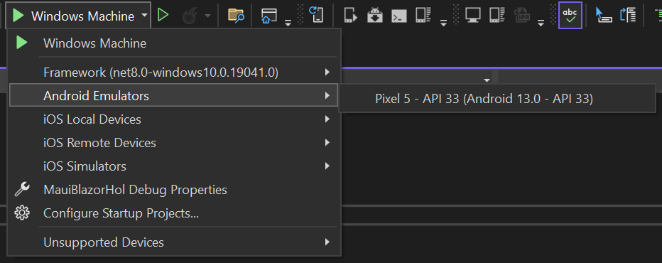

# MAUI Hybrid App

Welcome to the Blazor MAUI Hybrid App lab. In this lab, you will create a Blazor MAUI Hybrid App that runs on both mobile and desktop platforms, along with a Blazor web app that shares the same UI.

## Prerequisites

- Visual Studio 2026
- .NET 10.0 SDK
- .NET MAUI workload

## Creating the Solution

1. Open Visual Studio
2. Click on Create a new project
3. Select .NET MAUI Blazor Hybrid and Web App
4. Click Next
5. Enter the project name: `MauiBlazorHol`
6. Click Next
7. Use the following options:
   - Target Framework: .NET 10.0
   - Interactive render mode: Server
   - Interactivity location: Global
8. Click Create

The template creates three projects:

- `MauiBlazorHol` - the .NET MAUI app that hosts the Blazor UI in a `BlazorWebView` on Windows, Android, iOS, and macOS
- `MauiBlazorHol.Shared` - a Razor class library containing the shared UI (`Routes.razor`, `Layout`, and `Pages`) and service interfaces
- `MauiBlazorHol.Web` - a Blazor web app that hosts the same shared UI in the browser

Both the MAUI app and the web app reference the `MauiBlazorHol.Shared` project. Services that need a different implementation in each host are defined as interfaces in `MauiBlazorHol.Shared/Services` (for example, `IFormFactor`) and implemented in the `Services` folder of the `MauiBlazorHol` and `MauiBlazorHol.Web` projects.

## Run the application

1. Make sure `MauiBlazorHol` is the startup project and `Windows Machine` is the selected target
2. Press F5 to run the application
3. The application will open in Windows
4. You will see the default Blazor MAUI Hybrid App
5. Navigate to the `Counter` page
6. Click on the `Click me` button
7. You will see the counter incrementing
   - Notice how the page does not reload when the counter increments. This is because of data binding. The `currentCount` field is _bound_ to the output with `@currentCount`.
   - Also notice how the button click event is handled by the `IncrementCount` method. This is an example of event binding. The `@onclick` directive is used to bind the click event to the `IncrementCount` method.

## Run the web application

1. Set `MauiBlazorHol.Web` as the startup project
2. Press F5 to run the application
3. The application will open in your browser
4. You will see the same UI as the MAUI app, because the pages are in the `MauiBlazorHol.Shared` project
5. Notice how the `Home` page shows that the app is running on `Web`, while the MAUI app shows `Desktop` (or `Phone` on Android)

## Run the application on Android

1. Open the solution in Visual Studio
2. Set `MauiBlazorHol` as the startup project
3. Select your Android emulator or device

4. Press F5 to run the application
5. The application will open in Android
6. You will see the default Blazor MAUI Hybrid App
7. Navigate to the `Counter` page
8. Click on the `Click me` button
9. You will see the counter incrementing
   - Notice how the page does not reload when the counter increments. This is because of data binding. The `currentCount` field is _bound_ to the output with `@currentCount`.
   - Also notice how the button click event is handled by the `IncrementCount` method. This is an example of event binding. The `@onclick` directive is used to bind the click event to the `IncrementCount` method.

> ⚠️ **Note**: The Android emulator may take some time to start, the solution to build, and to be deployed. Be patient.

> ⚠️ **Note**: If you don't already have an Android emulator installed, use the [Android Emulator Manager](setup-android.md) to create one.

## Run the application on iOS or macOS

If you have an iOS device or Mac, you can run the application on those platforms. This is outside the scope of this lab.

## Using the MAUI Community Toolkit

The MAUI Community Toolkit is a collection of common elements for building MAUI applications. You can use the toolkit to add features to your application.

1. Add a reference to the `CommunityToolkit.Maui` package in the `MauiBlazorHol` project

> ⚠️ **Note**: The current `CommunityToolkit.Maui` package requires a recent version of MAUI. If you get a `NU1605` package downgrade error, update the `Microsoft.Maui.Controls` and `Microsoft.AspNetCore.Components.WebView.Maui` package references in the `MauiBlazorHol` project to the latest version (such as `10.0.101`).

2. Register the services in the `MauiProgram.cs` file

```csharp
            builder
                .UseMauiApp<App>()
                .ConfigureFonts(fonts =>
                {
                    fonts.AddFont("OpenSans-Regular.ttf", "OpenSansRegular");
                })
                .UseMauiCommunityToolkit();
```

3. Register the FolderPicker service in the `MauiProgram.cs` file

```csharp
            builder.Services.AddSingleton<IFolderPicker>(FolderPicker.Default);
```

The `Home` page is in the `MauiBlazorHol.Shared` project, which is also used by the web app, so it can't use MAUI types like `IFolderPicker` directly. Instead, the shared project defines an interface, and each host provides its own implementation.

4. Add a new interface called `IFolderPickerService` to the `Services` folder in the `MauiBlazorHol.Shared` project

```csharp
namespace MauiBlazorHol.Shared.Services;

public interface IFolderPickerService
{
    Task<string> PickFolderAsync();
}
```

5. Add a new class called `FolderPickerService` to the `Services` folder in the `MauiBlazorHol` project

```csharp
using CommunityToolkit.Maui.Storage;
using MauiBlazorHol.Shared.Services;

namespace MauiBlazorHol.Services;

public class FolderPickerService(IFolderPicker folderPicker) : IFolderPickerService
{
    public async Task<string> PickFolderAsync()
    {
        var result = await folderPicker.PickAsync();
        if (result.IsSuccessful)
        {
            return $"Picked folder: {result.Folder.Path}";
        }
        return $"No folder picked: {result.Exception?.Message}";
    }
}
```

6. Register the service in the `MauiProgram.cs` file

```csharp
            builder.Services.AddSingleton<IFolderPickerService, FolderPickerService>();
```

7. Add a new class called `FolderPickerService` to the `Services` folder in the `MauiBlazorHol.Web` project

```csharp
using MauiBlazorHol.Shared.Services;

namespace MauiBlazorHol.Web.Services;

public class FolderPickerService : IFolderPickerService
{
    public Task<string> PickFolderAsync()
    {
        return Task.FromResult("Picking a folder is not supported in the web app");
    }
}
```

8. Register the service in the `Program.cs` file of the `MauiBlazorHol.Web` project

```csharp
builder.Services.AddSingleton<IFolderPickerService, FolderPickerService>();
```

9. Open the `Pages/Home.razor` file in the `MauiBlazorHol.Shared` project
10. Add a text block and button to the page

```html
<div class="border border-secondary">
    <textarea rows="10">@Output</textarea>
    <br />
    <button class="btn btn-primary" @onclick="PickFolder">Pick Folder</button>
</div>
```

11. Add the `Output` property and `PickFolder` method to the `@code` block

```csharp
    private string Output { get; set; } = string.Empty;

    private async Task PickFolder()
    {
        Output = await FolderPicker.PickFolderAsync();
    }
```

12. Inject the `IFolderPickerService` service into the page (the page already has `@using MauiBlazorHol.Shared.Services`)

```csharp
@inject IFolderPickerService FolderPicker
```

13. Run the application
14. Click on the `Pick Folder` button
15. You will see a dialog to pick a folder
16. Pick a folder
17. You will see the path of the picked folder displayed on the page

Try this in Windows and Android and notice how the platform-specific file picker is used in each case. Also try it in the web app and notice how the web implementation of the service is used instead.

## Using a Per-Platform Service

You can define and use a per-platform service in your MAUI Blazor Hybrid App.

1. Add a new interface called `IPlatformInfo` to the `Services` folder in the `MauiBlazorHol.Shared` project

```csharp
namespace MauiBlazorHol.Shared.Services;

public interface IPlatformInfo
{
    PlatformInformation GetInfo();
}

public class PlatformInformation
{
    public string Model { get; set; } = "Unknown";
    public string Manufacturer { get; set; } = "Unknown";
    public string Version { get; set; } = "Unknown";
    public string Platform { get; set; } = "Unknown";

    override public string ToString()
    {
        return $"Model: {Model}, Manufacturer: {Manufacturer}, Version: {Version}, Platform: {Platform}";
    }
}
```

2. Add a new folder called `Services` to the `Platforms/Android` folder in the `MauiBlazorHol` project
3. Add a new class called `PlatformInfo` to the `Services` folder in the `Platforms/Android` folder

```csharp
using MauiBlazorHol.Shared.Services;

namespace MauiBlazorHol.Services;

public class PlatformInfo : IPlatformInfo
{
    public PlatformInformation GetInfo()
    {
        return new PlatformInformation
        {
            Model = Android.OS.Build.Model ?? "unknown",
            Manufacturer = Android.OS.Build.Manufacturer ?? "unknown",
            Version = Android.OS.Build.VERSION.Release ?? "unknown",
            Platform = "Android"
        };
    }
}
```

Notice the namespace is `MauiBlazorHol.Services`.

4. Add a new folder called `Services` to the `Platforms/Windows` folder in the `MauiBlazorHol` project
5. Add a new class called `PlatformInfo` to the `Services` folder in the `Platforms/Windows` folder

```csharp
using System.Runtime.InteropServices;
using MauiBlazorHol.Shared.Services;

namespace MauiBlazorHol.Services;

public class PlatformInfo : IPlatformInfo
{
    public PlatformInformation GetInfo()
    {
        return new PlatformInformation
        {
            Model = "Unknown PC",
            Manufacturer = "unknown",
            Version = Environment.OSVersion.ToString(),
            Platform = RuntimeInformation.OSDescription
        };
    }
}
```

Notice the namespace is `MauiBlazorHol.Services`.

6. The project also builds for iOS and Mac Catalyst, so add a `Services` folder to the `Platforms/iOS` and `Platforms/MacCatalyst` folders, and add a `PlatformInfo` class to each

```csharp
using MauiBlazorHol.Shared.Services;
using UIKit;

namespace MauiBlazorHol.Services;

public class PlatformInfo : IPlatformInfo
{
    public PlatformInformation GetInfo()
    {
        var device = UIDevice.CurrentDevice;
        return new PlatformInformation
        {
            Model = device.Model,
            Manufacturer = "Apple",
            Version = device.SystemVersion,
            Platform = device.SystemName
        };
    }
}
```

7. Register the service in the `MauiProgram.cs` file

```csharp
            builder.Services.AddTransient<IPlatformInfo, PlatformInfo>();
```

This is possible because all the types are in the same namespace. Normally such code couldn't compile because of the ambiguity, but in this case the "ambiguous" types are in different folders under `Platforms`.

Because the project builds once for each platform, the correct implementation of the service will be used for each platform.

8. Because the `Home` page is also used by the web app, add a new class called `PlatformInfo` to the `Services` folder in the `MauiBlazorHol.Web` project

```csharp
using System.Runtime.InteropServices;
using MauiBlazorHol.Shared.Services;

namespace MauiBlazorHol.Web.Services;

public class PlatformInfo : IPlatformInfo
{
    public PlatformInformation GetInfo()
    {
        return new PlatformInformation
        {
            Model = "Web server",
            Manufacturer = "unknown",
            Version = Environment.OSVersion.ToString(),
            Platform = RuntimeInformation.OSDescription
        };
    }
}
```

9. Register the service in the `Program.cs` file of the `MauiBlazorHol.Web` project

```csharp
builder.Services.AddTransient<IPlatformInfo, PlatformInfo>();
```

10. Open the `Pages/Home.razor` file in the `MauiBlazorHol.Shared` project
11. Add a text block to the page

```html
<div class="border border-secondary">
    <textarea rows="10">@Platform</textarea>
</div>
```

12. Add the `Platform` property to the `@code` block

```csharp
    private string Platform => PlatformInfo.GetInfo().ToString();
```

13. Inject the `IPlatformInfo` service into the page

```csharp
@inject IPlatformInfo PlatformInfo
```

14. Run the application
15. You will see the platform information displayed on the page
16. Notice how the platform information is different for Windows, Android, and the web app
