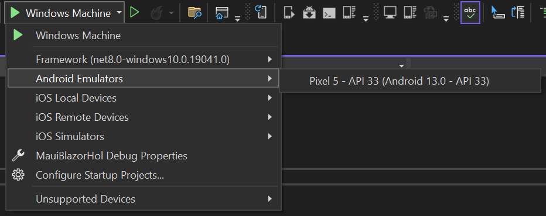

# MAUI Hybrid App

Welcome to the Blazor MAUI Hybrid App lab. In this lab, you will create a Blazor MAUI Hybrid App that runs on both mobile and desktop platforms.

## Prerequisites

- Visual Studio 2022
- .NET 8.0 SDK
- Blazor MAUI workload

## Creating the Solution

1. Open Visual Studio
2. Click on Create a new project
3. Select .NET MAUI Blazor Hybrid App
4. Click Next
5. Enter the project name: `MauiBlazorHol`
6. Click Next
7. Use the following options:
   - Target Framework: .NET 8.0
8. Click Create

## Run the application

1. Press F5 to run the application
2. The application will open in Windows
3. You will see the default Blazor MAUI Hybrid App
4. Navigate to the `Counter` page
5. Click on the `Click me` button
6. You will see the counter incrementing
   - Notice how the page does not reload when the counter increments. This is because of data binding. The `currentCount` field is _bound_ to the output with `@currentCount`.
   - Also notice how the button click event is handled by the `IncrementCount` method. This is an example of event binding. The `@onclick` directive is used to bind the click event to the `IncrementCount` method.

## Run the application on Android

1. Open the solution in Visual Studio
2. Select your Android emulator or device

3. Press F5 to run the application
4. The application will open in Android
5. You will see the default Blazor MAUI Hybrid App
6. Navigate to the `Counter` page
7. Click on the `Click me` button
8. You will see the counter incrementing
   - Notice how the page does not reload when the counter increments. This is because of data binding. The `currentCount` field is _bound_ to the output with `@currentCount`.
   - Also notice how the button click event is handled by the `IncrementCount` method. This is an example of event binding. The `@onclick` directive is used to bind the click event to the `IncrementCount` method.

> ⚠️ **Note**: The Android emulator may take some time to start, the solution to build, and to be deployed. Be patient.

> ⚠️ **Note**: If you don't already have an Android emulator installed, use the [Android Emulator Manager](setup-android.md) to create one.

## Run the application on iOS or macOS

If you have an iOS device or Mac, you can run the application on those platforms. This is outside the scope of this lab.

## Using the MAUI Community Toolkit

The MAUI Community Toolkit is a collection of common elements for building MAUI applications. You can use the toolkit to add features to your application.

1. Add a reference to the `Microsoft.Maui.CommunityToolkit` package
2. Register the services in the `MauiProgram.cs` file

```csharp
    builder.UseMauiApp<App>().ConfigureFonts(fonts =>
    {
        fonts.AddFont("OpenSans-Regular.ttf", "OpenSansRegular");
    }).UseMauiCommunityToolkit();
```

3. Register the FilePicker service in the `MauiProgram.cs` file

```csharp
    builder.Services.AddSingleton<IFolderPicker>(FolderPicker.Default);
```

4. Open the `Home.razor` file in the `MauiBlazorHol` project
5. Add a text block and button to the page

```html
<div class="border border-secondary">
    <textarea rows="10">@Output</textarea>
    <br />
    <button class="btn btn-primary" @onclick="PickFolder">Pick Folder</button>
</div>
```

6. Add the `Output` and `PickFolder` methods to the `Home` class

```csharp
@code 
{
    private string Output { get; set; } = string.Empty;

    private async Task PickFolder()
    {
        var result = await FolderPicker.PickAsync();
        result.EnsureSuccess();
        if (result != null)
        {
            Output = $"Picked folder: {result.Folder.Path}";
        }
    }
}
```

7. Inject the `IFolderPicker` service into the `Home` class

```csharp
@inject IFolderPicker FolderPicker
```

8. Run the application
9. Click on the `Pick Folder` button
10. You will see a dialog to pick a folder
11. Pick a folder
12. You will see the path of the picked folder displayed on the page

Try this in Windows and Android and notice now the platform-specific file picker is used in each case.

## Using a Per-Platform Service

You can define and use a per-platform service in your MAUI Blazor Hybrid App.

1. Add a new folder called `Services` to the `MauiBlazorHol` project
2. Add a new interface called `IPlatformInfo` to the `Services` folder

```csharp
namespace MauiBlazorHol.Services;

public interface IPlatformInfo
{
    PlatformInformation GetInfo();
}

public class PlatformInformation
{
    public string Model { get; set; } = "Unknown";
    public string Manufacturer { get; set; } = "Unknown";
    public string Version { get; set; } = "Unknown";
    public string Platform { get; set; } = "Unknown";

    override public string ToString()
    {
        return $"Model: {Model}, Manufacturer: {Manufacturer}, Version: {Version}, Platform: {Platform}";
    }
}
```

3. Add a new folder called `Services` to the `Platforms/Android` folder
3. Add a new class called `PlatformInfo` to the `Services` folder in the `Platforms/Android` folder

```csharp
namespace MauiBlazorHol.Services;

public class PlatformInfo : IPlatformInfo
{
    public PlatformInformation GetInfo()
    {
        return new PlatformInformation
        {
            Model = Android.OS.Build.Model ?? "unknown",
            Manufacturer = Android.OS.Build.Manufacturer ?? "unknown",
            Version = Android.OS.Build.VERSION.Release ?? "unknown",
            Platform = "Android"
        };
    }
}
```

Notice the namespace is `MauiBlazorHol.Services`.

4. Add a new folder called `Services` to the `Platforms/Windows` folder
5. Add a new class called `PlatformInfo` to the `Services` folder in the `Platforms/Windows` folder

```csharp
using System.Runtime.InteropServices;

namespace MauiBlazorHol.Services;

public class PlatformInfo : IPlatformInfo
{
    public PlatformInformation GetInfo()
    {
        return new PlatformInformation
        {
            Model = "Unknown PC",
            Manufacturer = "unknown",
            Version = Environment.OSVersion.ToString(),
            Platform = RuntimeInformation.OSDescription
        };
    }
}
```

Notice the namespace is `MauiBlazorHol.Services`.

6. Register the service in the `MauiProgram.cs` file

```csharp
    builder.Services.AddTransient<IPlatformInfo, PlatformInfo>();
```

This is possible because all the types are in the same namespace. Normally such code couldn't compile because of the ambiguity, but in this case the "ambiguous" types are in different folders under `Platforms`.

Because the project builds once for each platform, the correct implementation of the service will be used for each platform.

7. Open the `Home.razor` file in the `MauiBlazorHol` project
8. Add a text block to the page

```html
<div class="border border-secondary">
    <textarea rows="10">@Platform</textarea>
</div>
```

9. Add the `Platform` property to the `Home` class

```csharp
    private string Platform => PlatformInfo.GetInfo().ToString() ?? "no info";
```

10. Inject the `IPlatformInfo` service into the `Home` class

```csharp
@inject IPlatformInfo PlatformInfo
```

11. Run the application
12. You will see the platform information displayed on the page
13. Notice how the platform information is different for Windows and Android
