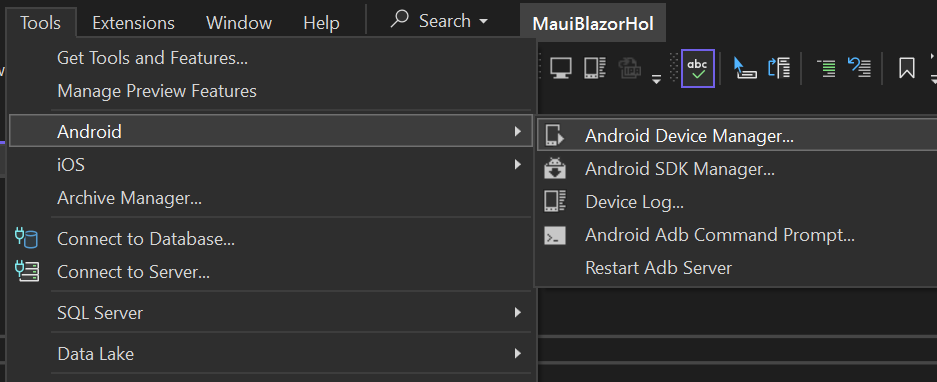
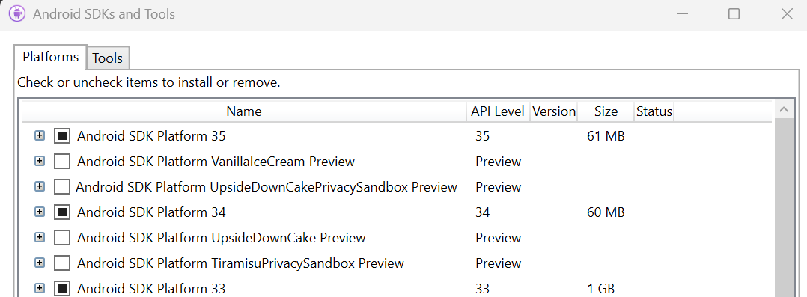
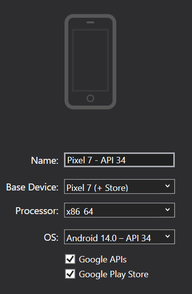

# Setting Up an Android Emulator

These instructions are for Windows 11 and Visual Studio 2022. If you are using a different operating system or version of Visual Studio, the steps may be different.

## Determine the Android SDKs Installed

1. Open the Android SDK Manager from the Tools menu in Visual Studio

2. Examine the list of SDKs and note which ones are installed

In my example, I have versions 35, 34, and 33 installed.

## Installing the Android Emulator

1. Open the Android Device Manager from the Tools menu in Visual Studio

2. Click on the `+` button; for me the default device is a Pixel

_Make sure_ the device you select is compatible with the SDKs you have installed. For example, if you only have SDK 33 installed, you should select a device that is compatible with that SDK.

> ℹ️ If you choose a device that is not compatible with the installed SDKs, you will need use the Android SDK Manager to install the necessary SDK. This can be time consuming.

3. Click on the `Create` button
4. The emulator will be created
